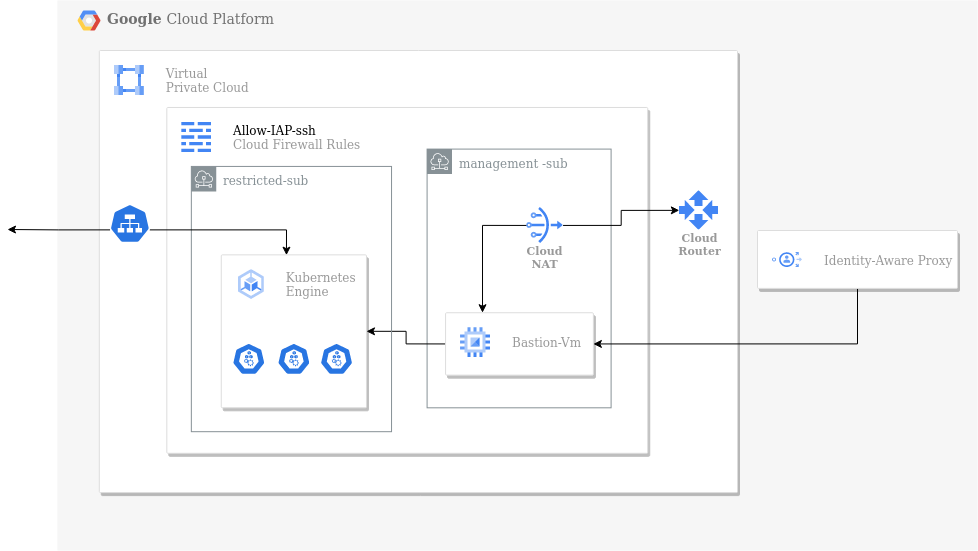
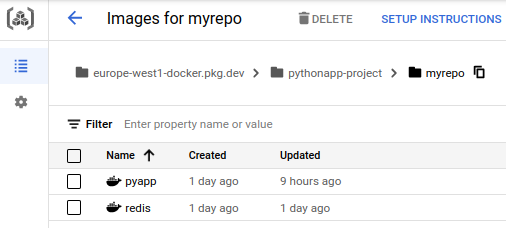

<h1 align="center">Deploying python app on GCP</h1>


<div id="header" align="center">
  
</div>

# 

## Requirements :

1. Management subnet has the following:
• NAT gateway
• Private VM
2. Restricted subnet has the following:
• Private standard GKE cluster (private control plan)

Notes:

1. Restricted subnet must not have access to internet
2. All images deployed on GKE must come from GCR or Artifacts registry.
3. The VM must be private.
4. Deployment must be exposed to public internet with a public HTTP load balancer.
5. All infra is to be created on GCP using terraform.
6. Deployment on GKE can be done by terraform or manually by kubectl tool.
7. The code to be build/dockerized and pushed to GCR is on here:
[https://github.com/atefhares/DevOps-Challenge-Demo-Code](https://github.com/atefhares/DevOps-Challenge-Demo-Code)
8. Don’t use default compute service account while creating the gke cluster, create custom SA and attach it to your nodes.
9. Only the management subnet can connect to the gke cluster

## Project diagram :



## Steps :

### 1. Create a docker image of the app and push it to Google Artifact Repository

```bash
docker build . -t myapp:1
docker tag myapp:1 europe-west1-docker.pkg.dev/project-id/myrepo/app
docker push europe-west1-docker.pkg.dev/project-id/myrepo/app
```



### 2. Create the infrastructure using Terraform

- Network components
- Firewalls
- Service accounts
- Bastion - vm
- GKE

### 3. Configure the bastion - vm

```bash
#install google-cloud-sdk
sudo apt-get install apt-transport-https ca-certificates gnupg

echo "deb [signed-by=/usr/share/keyrings/cloud.google.gpg] \
https://packages.cloud.google.com/apt cloud-sdk main" \
| sudo tee -a /etc/apt/sources.list.d/google-cloud-sdk.list

curl https://packages.cloud.google.com/apt/doc/apt-key.gpg \
| sudo apt-key --keyring /usr/share/keyrings/cloud.google.gpg add -

sudo apt update
sudo apt install google-cloud-sdk

#install kubectl
sudo apt-get install kubectl

#connect to the gke master
sudo apt-get install google-cloud-sdk-gke-gcloud-auth-plugin
gcloud container clusters get-credentials cluster-name \
--zone europe-west1-b --project project-id
```

### 4. Create deployments and services using kubectl :

.png)

### 5. Run the app using loadbalancer ip


